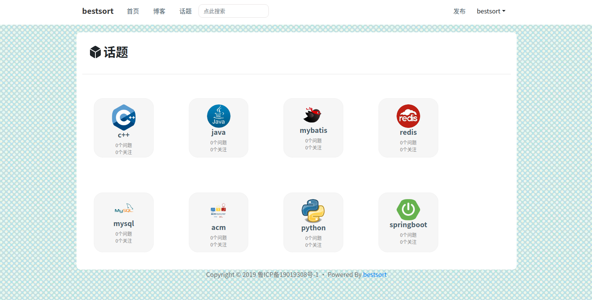
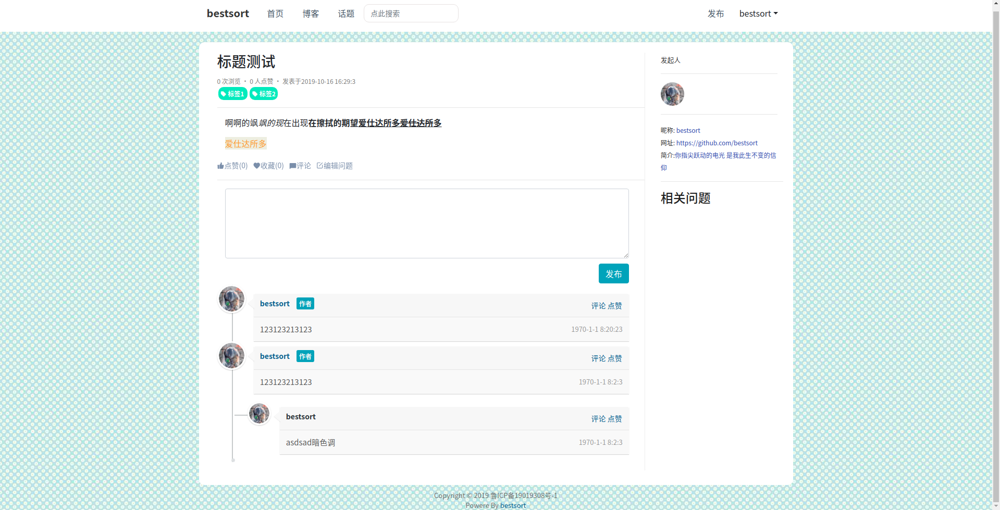

<h1 align="center">Welcome to BBS-Lite </h1>
<span align="center">


</span>
<hr>

> 这是一个基于 Spring Boot 搭建的轻论坛

## TODO

- [x] 发布问题
- [x] 修改问题
- [x] 查看我的问题
- [x] 评论
- [x] 文章搜索
- [ ] 多级评论
- [ ] 查看最新评论
- [ ] 标签分类
- [ ] 热门推荐
- [ ] 文章排序
- [ ] 个人资料

## Demo





## 快速开始
### 依赖
在使用前,请确保电脑中已配置好以下环境:
- maven
- redis
- mysql
- jdk-8

### 开始
```bash
git clone https://github.com/bestsort/BBS-Lite.git
cd BBS-lite
```
将该项目导入到 IDEA 或者其他的IDE中,并配置`/src/main/resources/application.yml`
和`/src/main/resources/generatorConfig.xml`和`pom.xml`中`build`标签中的数据库信息为自己的数据库配置然后执行以下命令
```bash
mvn package
mvn flyway:migrate
mvn -Dmybatis.generator.overwrite=true mybatis-generator:generate
```
最后,配置好 Tomcat 即可启动项目

## 采用技术及工具

- Spring Boot(快速构建应用)
    - spring-boot-starter-jdbc
    - spring-boot-starter-web
    - spring-boot-starter-mybatis(SQL 模板引擎)
    - spring-boot-starter-thymeleaf(HTML 模板引擎)
- Fastjson(JSON 文本处理)
- Redis(缓存)
- OkHttp3(处理网络请求)
- Flyway(数据库版本控制)
- Bootstrap4(前端框架)
- Druid(数据库连接池)
- Maven(包管理)
- Font Awesome(图标库)
- Log4j(日志记录)

---
### 其他
- IntelliJ IDEA
- MySQL Workbench
- Git
- Chrome
- Lombook(IDEA插件 自动处理@Data注解)
- Postman(Chrome插件 向后端提交请求)
## 作者
**bestsort**
